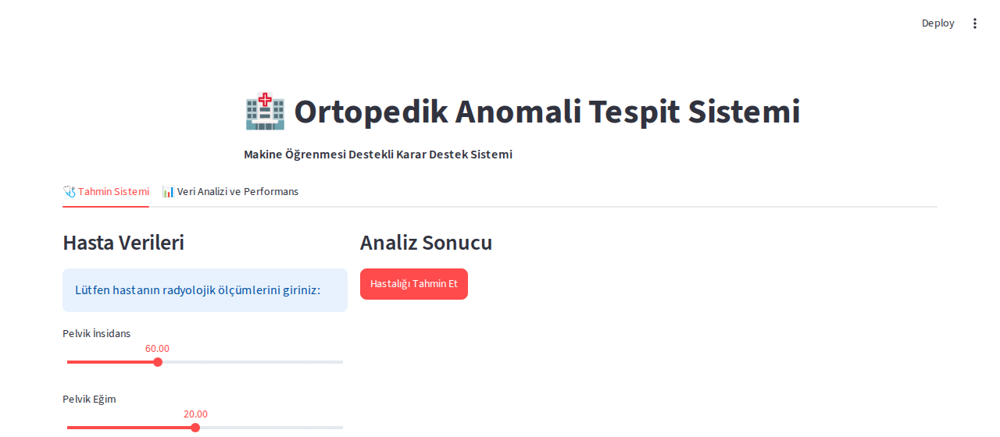
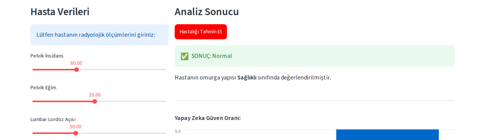
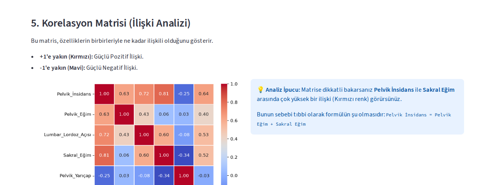

# 🏥 Ortopedik Anomali Tespit Sistemi

Makine öğrenmesi destekli bir **karar destek sistemi (KDS)**: hastaların radyolojik ölçümlerinden (pelvik açılar, lomber lordoz vb.) yola çıkarak omurga yapısını **Normal** ya da **Anormal** (bel fıtığı / spondilolistezis riski) olarak sınıflandırır. Arayüz [Streamlit](https://streamlit.io) ile geliştirilmiştir.

> *English:* A machine-learning decision-support system that classifies spinal condition (Normal / Abnormal) from biomechanical measurements, built with scikit-learn and an interactive Streamlit UI.

🔗 **Canlı demo:** https://ortopedik-anomali-tespit.streamlit.app/



## Özellikler

- 🩺 **Tahmin sistemi:** 6 radyolojik ölçümü kaydırma çubuklarıyla girip anlık tahmin alma
- 📊 **Güven oranı grafiği:** modelin "Normal" / "Anormal" olasılıklarını görselleştirir
- 📈 **Veri analizi sekmesi:** veri setine genel bakış, istatistikler, hasta dağılımı, değişkenler arası saçılım grafiği
- 🔥 **Korelasyon matrisi:** özellikler arasındaki ilişkiyi ısı haritasıyla gösterir
- 🧩 **Karmaşıklık matrisi (confusion matrix):** modelin doğru/yanlış tahmin dağılımı
- ⚙️ **3 algoritma karşılaştırması:** Random Forest, SVM ve KNN eğitilip test başarıları karşılaştırılır

| Tahmin sonucu | Korelasyon matrisi |
| --- | --- |
|  |  |

## Veri seti ve kaynak

- **Veri seti:** [Vertebral Column Dataset](https://www.kaggle.com/datasets/caesarlupum/vertebralcolumndataset) (Kaggle üzerinden, orijinal kaynak: UCI Machine Learning Repository / Dr. Henrique da Mota)
- **Kayıt sayısı:** 310 satır, 6 özellik + 1 hedef değişken (`column_2C.csv` — ikili sınıflandırma: Normal / Abnormal)
- **Literatür karşılaştırması:** Reshi, A. A. et al. (2021), *"Diagnosis of vertebral column pathologies using concatenated resampling with machine learning algorithms"*, PeerJ Computer Science. ([makaleye bağlantı](https://peerj.com/articles/cs-547/)) — bu çalışmada Random Forest %88, SVM %85 doğruluk elde etmiştir; bu projede KNN ile elde edilen %83.87 sonucu literatürle tutarlıdır.

## Model performansı

| Algoritma | Test Doğruluğu |
| --- | --- |
| **KNN (En Yakın Komşu)** 🏆 | **%83.87** |
| SVM (Destek Vektör) | %80.65 |
| Random Forest | %77.42 |

`model_egit.py` çalıştırıldığında veriler %80/%20 (eğitim/test) olarak bölünür (`random_state=42`, tekrarlanabilir sonuçlar için), üç algoritma da eğitilir ve en başarılı model (`fiziktedavi_model.pkl`) ile tüm skorlar (`model_skorlari.pkl`) diske kaydedilir.

## Teknolojiler

| Katman | Teknoloji |
| --- | --- |
| Dil | Python |
| Makine öğrenmesi | scikit-learn (Random Forest, SVM, KNN) |
| Arayüz | Streamlit |
| Veri işleme / görselleştirme | pandas, matplotlib, seaborn |
| Model kaydı | joblib |

## Kurulum

Gereksinim: **Python 3.10+**

```bash
git clone https://github.com/mertokzlky/ortopedik-anomali-tespit.git
cd ortopedik-anomali-tespit
python -m venv venv
venv\Scripts\activate        # Windows
# source venv/bin/activate   # macOS/Linux
pip install -r requirements.txt
```

Model dosyaları (`fiziktedavi_model.pkl`, `model_skorlari.pkl`) depoda hazır geliyor; uygulamayı doğrudan çalıştırabilirsiniz:

```bash
streamlit run app.py
```

Modeli sıfırdan yeniden eğitmek isterseniz:

```bash
python model_egit.py
```

## Proje yapısı

```
ortopedik-anomali-tespit/
├── app.py                 # Streamlit arayüzü (tahmin + veri analizi sekmeleri)
├── model_egit.py          # Veriyi okuyup 3 algoritmayı eğiten, en iyisini kaydeden betik
├── column_2C.csv          # Vertebral Column veri seti (310 kayıt)
├── fiziktedavi_model.pkl  # Eğitilmiş en iyi model (KNN)
├── model_skorlari.pkl     # Üç algoritmanın test başarı oranları
├── requirements.txt
├── .gitignore
└── docs/screenshots/      # README'deki ekran görüntüleri
```

## Dağıtım (Streamlit Community Cloud)

1. [share.streamlit.io](https://share.streamlit.io) adresine GitHub hesabınızla giriş yapın.
2. **New app** → bu repoyu seçin, ana dosya olarak `app.py`'yi belirtin.
3. Deploy edin; birkaç dakika içinde canlı bir link alırsınız. Bu linki yukarıdaki "Canlı demo" satırına ekleyin.

## Geliştirme fikirleri

- Görsel özelliklerin (banner, anatomi referans görseli) eklenmesi
- Model karşılaştırmasına çapraz doğrulama (cross-validation) eklenmesi
- Kullanıcının girdiği verilerin normal aralık dışına çıkması durumunda uyarı gösterilmesi
- `pytest` ile modelin temel sağlık kontrollerinin (ör. bilinen bir girdi için beklenen sınıfı döndürmesi) test edilmesi

## Sorumluluk reddi

Bu proje bir üniversite dersi kapsamında geliştirilmiş akademik bir çalışmadır ve **gerçek tıbbi teşhis amacıyla kullanılamaz**. Sonuçlar yalnızca eğitim ve gösterim amaçlıdır; kesin teşhis için mutlaka bir sağlık uzmanına başvurulmalıdır.

## Geliştirici

**Mert Ali Kızılkaya** — Yazılım Mühendisliği öğrencisi
GitHub: [@mertokzlky](https://github.com/mertokzlky)

